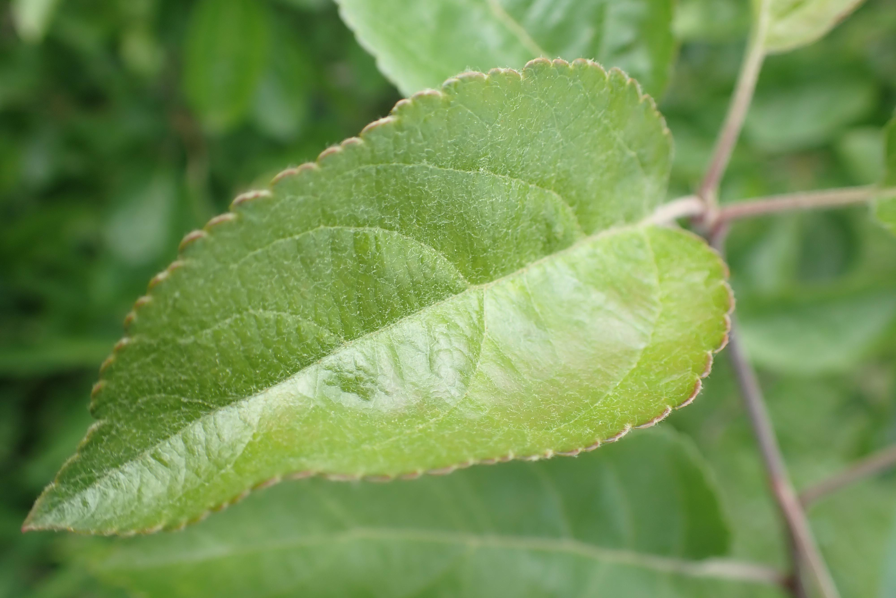

# 🌿 Plant Disease Classification using Machine Learning

---

## 📌 Project Overview

This project detects **plant diseases** from leaf images using a classical Machine Learning approach (Random Forest).  
It utilizes **image preprocessing**, **feature extraction** (HOG, LBP, Color Histogram), and **multi-class classification** to distinguish between healthy and diseased plants.

---

## 🗂️ Dataset

📦 The dataset used is from [Kaggle – Plant Disease Recognition Dataset](https://www.kaggle.com/datasets/rashikrahmanpritom/plant-disease-recognition-dataset)

### Classes:
- 🌱 **Healthy**
- 🍃 **Powdery Mildew**
- 🍂 **Rust**

### Structure:
Plant_Disease/
├── Train/
│ ├── Healthy/
│ ├── Powdery/
│ └── Rust/
├── Validation/
│ ├── Healthy/
│ ├── Powdery/
│ └── Rust/
└── Test/
├── Healthy/
├── Powdery/
└── Rust/


---

## 🔍 Feature Extraction

The following features were extracted from each image:

- 📐 **HOG (Histogram of Oriented Gradients)**
- 🌈 **Color Histogram**
- 🔳 **LBP (Local Binary Pattern)**

These features were combined into a single feature vector for model training.

---

## 🎯 Model

Model used: **Random Forest Classifier**

✅ Random Forest trained on full training set.

📊 Training Performance:
Accuracy: 95.54%

              precision    recall  f1-score   support

     Healthy       0.92      0.97      0.94       458
     Powdery       0.96      0.95      0.95       430
        Rust       1.00      0.95      0.97       434

    accuracy                           0.96      1322


📊 Test Performance:
Accuracy: 90.67%


              precision    recall  f1-score   support

     Healthy       0.85      0.90      0.87        50
     Powdery       0.90      0.90      0.90        50
        Rust       0.98      0.92      0.95        50

    accuracy                           0.91       150

---

## 📓 Jupyter Notebook (Optional)

📄 `planet_Diseases.ipynb` includes:

- 📂 Data loading  
- 🧪 Feature extraction  
- 🏷️ Label encoding  
- 🧠 Model training & saving  
- 📊 Evaluation  
- 🚀 Deployment-ready export

---
🖼️ Prediction Example

📸 Sample Prediction Output:



---
🧠 Future Improvements:

Upgrade to Deep Learning (EfficientNet / CNN)

Add more disease classes

Include Grad-CAM for model interpretability

Deploy with Docker or on HuggingFace Spaces


## 👨‍💻 **Author**

**Eng. Shenouda Safwat**  
🔗 [**LinkedIn**](https://www.linkedin.com/in/shenouda-safwat-bb0993259)  
🐙 [**GitHub**](https://github.com/shenouda-safwat)


## 🚀 Streamlit App

A Streamlit app was built to allow users to upload a leaf image and receive a disease prediction.

### 🛠 How to Run:

```bash
git clone https://github.com/shenouda-safwat/plant-disease-classifier-ML.git
cd plant-disease-classifier-ML
pip install -r requirements.txt
streamlit run Streamlit/app.py


